# 🌍 Clear View – Community-Powered Pollution Reporting Platform

[](https://drive.google.com/file/d/18UcGIUkUaIaakoNc-T00s3mGGEgI5bQ2/view?usp=sharing)
[](https://clearview360.netlify.app/)

> Empowering communities to report, visualize, and act on environmental pollution – starting with India’s invisible informal industry emissions.

---

## 🧠 Problem

Unseen pollution from informal industries across India continues to contaminate local ecosystems and communities. There’s a lack of **real-time, geotagged data** to take timely action or raise awareness.

---

## ✅ Our Solution: Clear View

**Clear View** is a mobile-first, community-powered web app that allows users to **report environmental pollution incidents**. The platform **geotags and visualizes** pollution data on an interactive public map. It supports **AI-assisted classification**, **NGO collaboration**, and **biodiversity hotspot tracking**.

---

## ⚡ Key Features (Hackathon MVP – Built under 72 Hours)

- 📸 **Simple Reporting Interface**: Submit pollution reports via a mobile-friendly form. Auto-captures geolocation. Supports image upload.
- 🗺️ **Geotagged Hotspot Map**: Displays reports on a real-time, interactive Leaflet map.
- 🧠 **AI-Powered Image Classification**: Uses TensorFlow MobileNet to detect pollution in submitted photos.
- 🔍 **Filtering and Clustering**: Filter by pollution type, date range. Visual indicators for high-density zones.
- 🔐 **User Authentication**: Basic login/signup with Firebase. NGOs can apply for verification.
- 🧾 **Dashboards**: Personal dashboards for users, NGOs, and admins to track or manage reports.
- 🐛 **Report Statuses**: Each report moves through `Pending → Approved/Rejected → Resolved`.

---

## 📱 Screenshots

> 📂 _Located in the `/snips` folder_

## 📱 Screenshots

| Home | About | Manual |
|---------------|-------------|----------------|
| 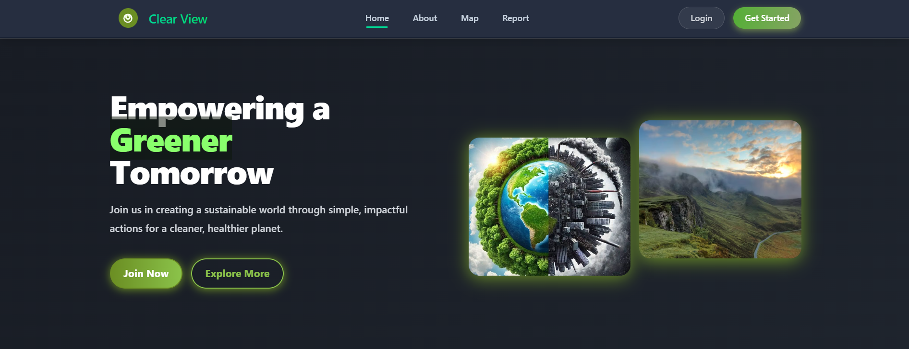 | 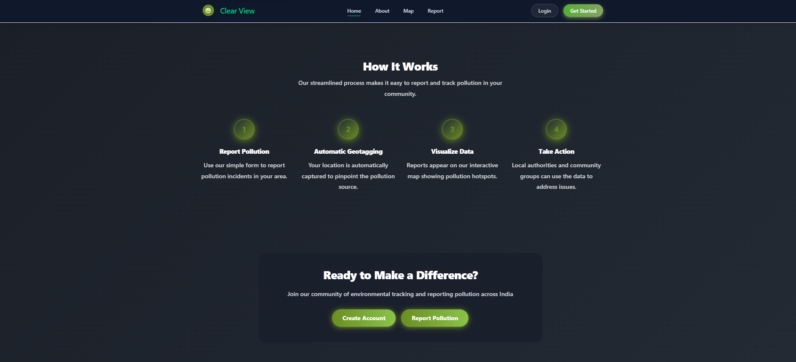 | 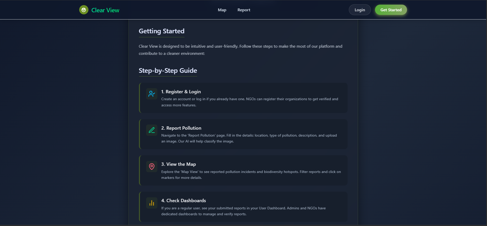 |

| Login | Register | Contribute |
|-------|----------|--------|
| 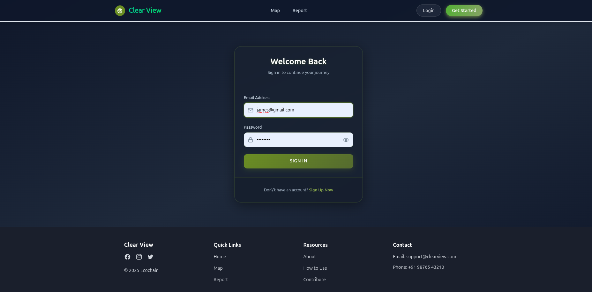 | 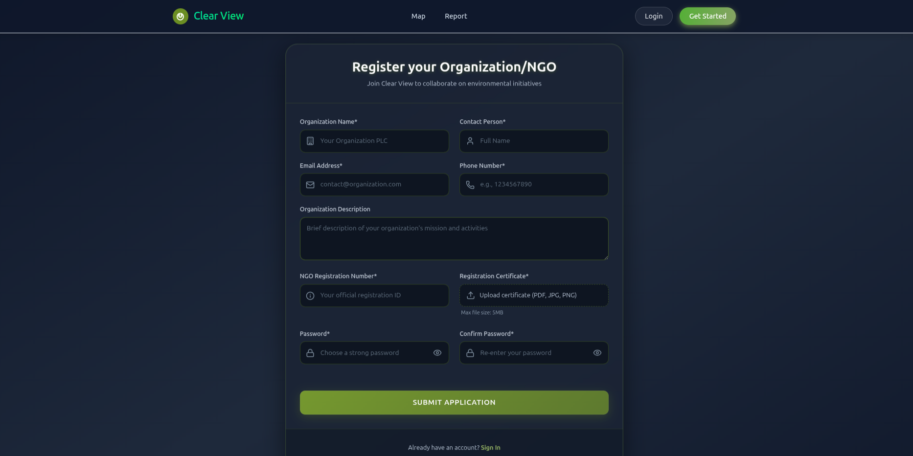 | 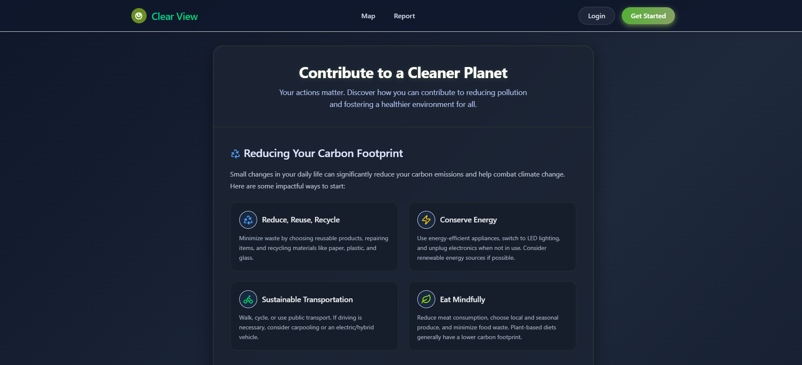 |

| User Dashboard | NGO Dashboard | Admin Dashboard |
|---------------|-------------|----------------|
| 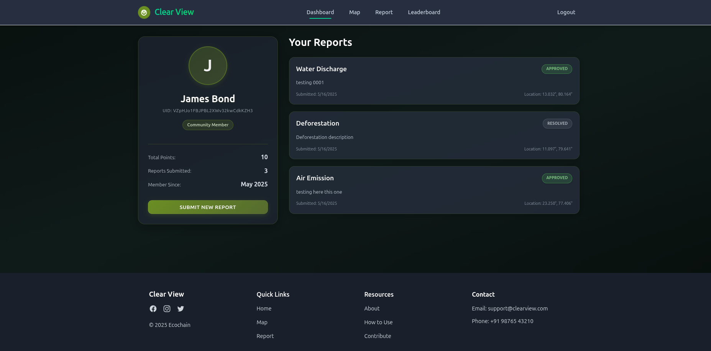 | 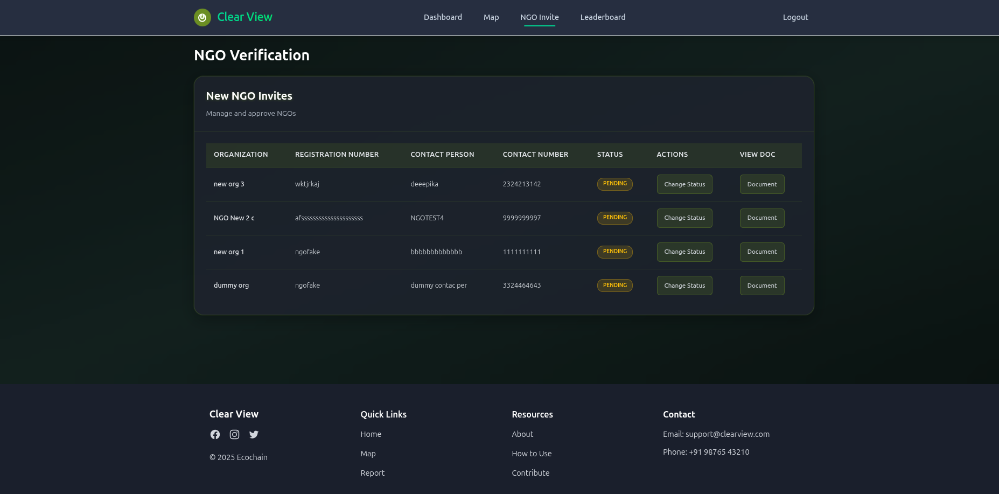 | 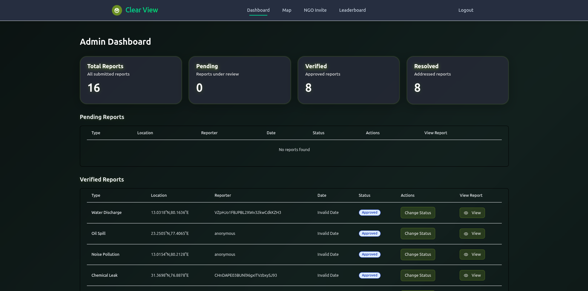 |

| Map | Report | Leaderboard |
|-----|----------------|-----------------|
| 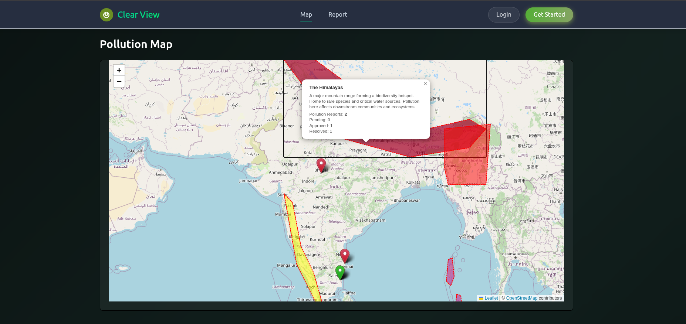 | 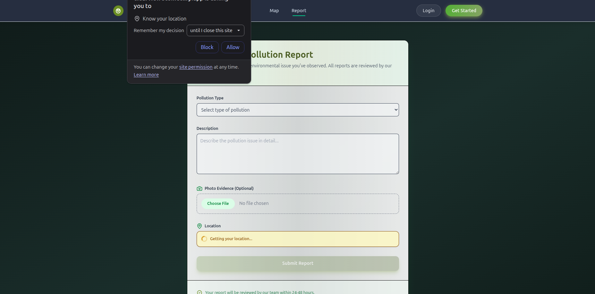 | 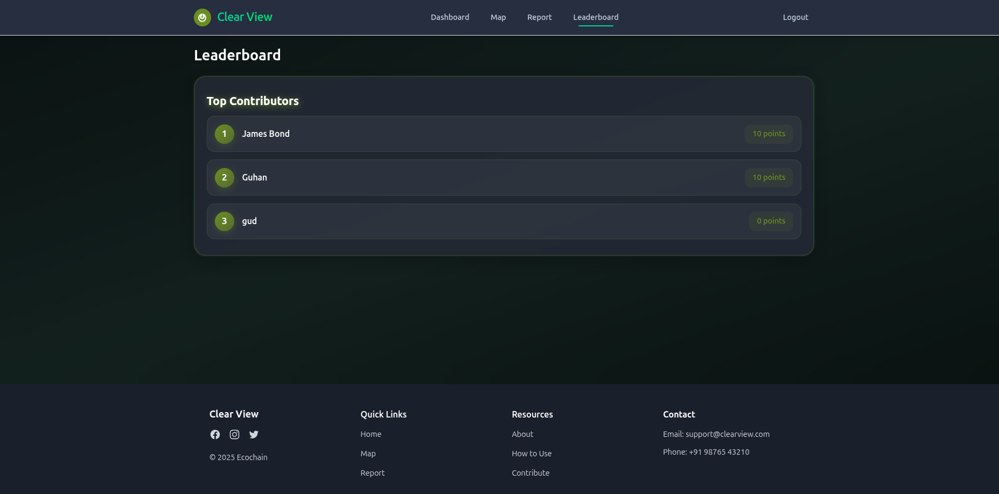 |


---

## 🎥 Demo Video

📽️ [Watch the Demo](https://drive.google.com/file/d/18UcGIUkUaIaakoNc-T00s3mGGEgI5bQ2/view?usp=sharing)

---

## 🚀 Live App

🌐 [Visit the Deployed Site](https://clearview360.netlify.app/)

---

## 🛠️ Tech Stack

**Frontend:**

- [React](https://react.dev/)
- [Vite](https://vitejs.dev/)
- [Tailwind CSS](https://tailwindcss.com/)
- [Leaflet.js](https://leafletjs.com/) - For maps

**Backend / Infra:**

- [Firebase Authentication](https://firebase.google.com/docs/auth)
- [Cloudinary](https://cloudinary.com/) - For data storage
- [Netlify Hosting](https://www.netlify.com/)

**ML Integration:**

- [TensorFlow.js](https://www.tensorflow.org/js) with MobileNet for pollution image classification

---

## 📦 How to Run Locally

Clone the repository

```bash
  git clone https://github.com/deebhikakumaran/Clear-View.git
```

Navigate to the project directory

```bash
  cd Clear-View
```

Add Firebase configuration

```bash
  Replace the placeholders in /src/config/firebase.js with your Firebase credentials
```

Install dependencies

```bash
  npm install
```

Start the server

```bash
  npm run dev
```

## 🤝 Contributing (Coming soon)

We welcome contributions! Please read our [Contributing Guidelines](CONTRIBUTING.md) to get started.

---

## 📜 License (Not yet licensed)

This project is licensed under the [MIT License](LICENSE).

---

## 🙏 Acknowledgements

- This project was built during the Hackathon Hack Eclipse
- Special thanks to Vighnesh for his mentoring

---

## 🧑‍💻 Team
- [Atharv Khare](https://github.com/1mystic)
- [Deebhika Kumaran](https://github.com/deebhikakumaran)
- [Sumit Kumar](https://github.com/sumitkr2000)
- [Bappaditya](https://github.com/Bappaditya13)

---